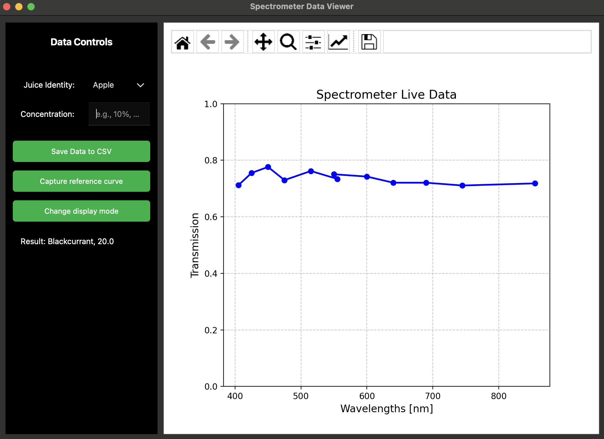

# OpenJuice (OJ): Multispectral sensor spectrophotometer for fruit juice quality inspection

Sensor Technologies and Applications coursework 16/12/2025.

Kenton Kwok

## Installation

### Configuring the Arduino

1. Install Arduino IDE
2. Plug the Arduino into the computer via USB. Ensure that the Arduino IDE can find detect the Arduino device.
3. Ensure that SparkFun AS7343 Arduino Library is included using the Library Manager
4. Import and flash `spectrometer.ino` onto the device

This script (spectrometer.ino) is mainly based on an example script from SparkFun (see license) in the file.

### Running the main GUI

This has been tested on Python 3.13.2. The main function uses serial communications with the Arduino. Ensure that the serial monitor is off when running the Python GUI or else it won't run.



```bash
# Installation
python3 -m venv venv
source venv/bin/activate
pip install -m requirements.txt
```

To run

```bash
python3 gui.py
```

### Creating figures

Figures are in `analysis.ipynb` for replication.

## Mechanical construction of 3D Model

Please follow construction instructions in the Appendix of the report.

## License

Copyright 2025 Kenton Kwok.

Permission is hereby granted, free of charge, to any person obtaining a copy of this software and associated documentation files (the “Software”), to deal in the Software without restriction, including without limitation the rights to use, copy, modify, merge, publish, distribute, sublicense, and/or sell copies of the Software, and to permit persons to whom the Software is furnished to do so, subject to the following conditions:

The above copyright notice and this permission notice shall be included in all copies or substantial portions of the Software.

THE SOFTWARE IS PROVIDED “AS IS”, WITHOUT WARRANTY OF ANY KIND, EXPRESS OR IMPLIED, INCLUDING BUT NOT LIMITED TO THE WARRANTIES OF MERCHANTABILITY, FITNESS FOR A PARTICULAR PURPOSE AND NONINFRINGEMENT. IN NO EVENT SHALL THE AUTHORS OR COPYRIGHT HOLDERS BE LIABLE FOR ANY CLAIM, DAMAGES OR OTHER LIABILITY, WHETHER IN AN ACTION OF CONTRACT, TORT OR OTHERWISE, ARISING FROM, OUT OF OR IN CONNECTION WITH THE SOFTWARE OR THE USE OR OTHER DEALINGS IN THE SOFTWARE.
